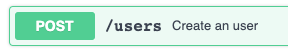
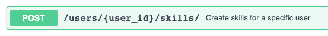
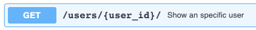
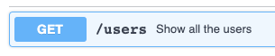
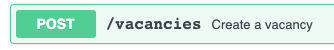
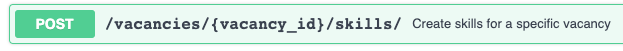
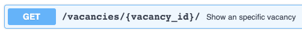
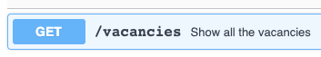
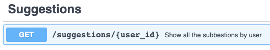
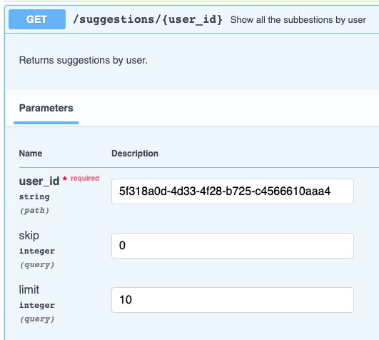

# finding jobs API

Finding Jobs API - Technical Proof

Esta API esta desarrollada con:

- FastAPI

- Docker

- Postgres

- GCP

## Programs

Se requiere teneer instalado los siguientes programas:

- Python3

- Docker

## Enviroment File

```bash
# Utilizar el comando para copiar el template al archivo .env
cp env.template .env
```

## Build Docker

Para crear el contenedor, ejecutarlo y crear las tablas de la base de datos.

```bash
# Crea el contenedor:
docker-compose -f Developer.yml build

# Inicializa el contenedor:
docker-compose -f Developer.yml up -d

# Ingresar al contenedor:
docker exec -it dev_api_finding_jobs bash

# Ejecutar achivo para crear las tablas en la base de datos y copiar los datos a la BD:
python3 create_tables.py

# Para salir del contenedor
exit
```

## Acceder a la API

Para ingresar a la aplicación dar clic en el link.

[localhost:8000](http://localhost:8000/)

La API en produccion se encuentra en la URL:

[https://kannder83.com/api/finding-jobs/](https://kannder83.com/api/finding-jobs/#/Suggestions)

## Creación y consulta de User

1. Se debe crear un usuario desde el endpoint:



El JSON para crearlo es:

```json
{
  "FirstName": "Daniela",
  "LastName": "Perez",
  "Email": "example1@xyz.com",
  "YearsPreviousExperience": 2
}
```

2. Para agregar la experiencia al usuario se utiliza el endpoint:



Se requiere conocer el UserId, luego usando el JSON se agega la experiencia:

UserID: 5f318a0d-4d33-4f28-b725-c4566610aaa4

```json
{
  "SkillName": "react",
  "YearsOfExperience": 2
}
```

3. Para confirma que la experiencia fue agregada al usuario utilizar el endpoint de consulta por UserId:



Se tiene un JSON de respuesta como el siguiente:

```json
{
  "FirstName": "Daniela",
  "LastName": "Perez",
  "Email": "example1@xyz.com",
  "YearsPreviousExperience": 2,
  "UserId": "5f318a0d-4d33-4f28-b725-c4566610aaa4",
  "Skills": [
    {
      "SkillName": "python",
      "YearsOfExperience": 1,
      "SkillId": 1
    },
    {
      "SkillName": "react",
      "YearsOfExperience": 2,
      "SkillId": 2
    }
  ]
}
```

4. Se puede obtener información de todos los usuarios consultando el endpoint:



## Creación y consulta de Vancancy

1. Se debe crear una vacante desde el endpoint:



El JSON para crearlo es:

```json
{
  "PositionName": "Diseñador",
  "CompanyName": "Universal",
  "Salary": 1000,
  "Currency": "USD",
  "VacancyLink": "www.linkjobs.com/oferta"
}
```

2. Para agregar los skill a la vacante se utiliza el endpoint:



Se requiere conocer el VacancyId, luego usando el JSON se agega el skill:

VacancyId: 11bc5878-fc6b-487f-bfd3-0c0064d13454

```json
{
  "SkillName": "react",
  "YearsOfExperience": 1,
  "SkillId": 2
}
```

3. Para confirma que la experiencia fue agregada a la vacante utilizar el endpoint de consulta por VacancyId:



Se tiene un JSON de respuesta como el siguiente:

```json
{
  "PositionName": "Diseñador",
  "CompanyName": "Universal",
  "Salary": 1000,
  "Currency": "USD",
  "VacancyLink": "www.linkjobs.com/oferta",
  "VacancyId": "11bc5878-fc6b-487f-bfd3-0c0064d13454",
  "RequiredSkills": [
    {
      "SkillName": "react",
      "YearsOfExperience": 1,
      "SkillId": 2
    }
  ]
}
```

4. Se puede obtener información de todas las vacantes consultando el endpoint:



## Buscando las sugerencias:

1. Con el UserID ir al endpoint:

UserId: 5f318a0d-4d33-4f28-b725-c4566610aaa4



2. Realizar la busqueda por el UserID:



3. En caso de existir una oferta donde los skill del usuario sean igual o mayor del 50% de match, se mostrara el VancancyID y el Affinity con la vacante:

```py
[
  {
    "VacancyID": "657b471c-253d-4af6-8d43-1f3061c34f2d",
    "Affinity": 100
  },
  {
    "VacancyID": "11bc5878-fc6b-487f-bfd3-0c0064d13454",
    "Affinity": 100
  }
]
```

4. Con el VacancyID se puede ir a buscar la oferta indicada y confirmar la afinidad:

```json
{
  "PositionName": "Developer",
  "CompanyName": "Stark Industies",
  "Salary": 2000,
  "Currency": "USD",
  "VacancyLink": "www.linkjobs.com",
  "VacancyId": "657b471c-253d-4af6-8d43-1f3061c34f2d",
  "RequiredSkills": [
    {
      "SkillName": "python",
      "YearsOfExperience": 1,
      "SkillId": 1
    }
  ]
}
```

5. En caso de no haber ofertas para ese usuario, se mostrara un Not Found.

```json
{
  "detail": "UserID: 37e56553-4d30-4593-952c-215ab37d3d93 Not Found Skills"
}
```

## Borrar la información

```bash
# Borra toda la configuración:
docker-compose -f Developer.yml down --remove-orphans -v
```
